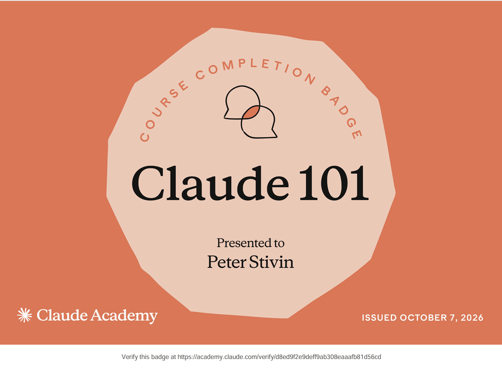
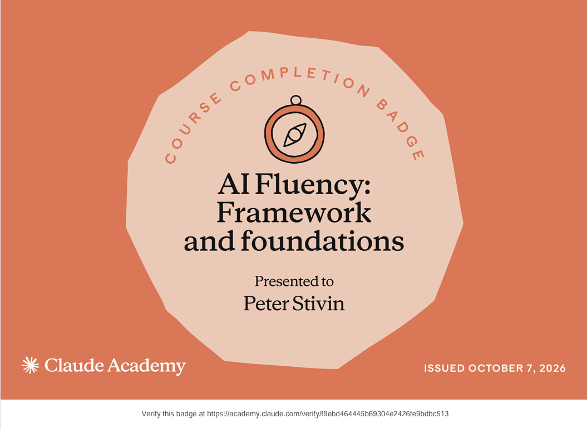

# What I Took Away from Claude 101 and AI Fluency

## Before
Before these courses, I used Claude mostly as a chat window. I asked questions
like "why is this breaking" or "how do I do this" with little context, and
treated each conversation as separate. I didn't use Projects or custom
instructions, so I repeated the same background every time, and the answers
were often generic. For my work on a legal office management application, I
had to explain the domain again and again: court types, case numbers, and the
information a lawyer needs to see.

## After: Claude 101
The course showed me what Claude can do beyond basic chat, and I now use:

- **Artifacts** to preview and download code and documents, rather than
  copying long outputs out of the chat.
- **Projects** to keep the application's context in one place, so each
  conversation starts with the same background.
- **Custom instructions** to state my role, tech stack (C#, .NET, WPF, SQLite),
  and preferences once, instead of in every prompt.
- **Supporting documents** such as my case-type reference list, so Claude
  works from real material instead of guessing.
- **Connectors** to GitHub, so Claude can look at actual repository content
  rather than pasted fragments.

I also learned which features need a Pro plan, such as extended thinking and
Research, so I know when the free plan is enough.

## After: AI Fluency — Framework & Foundations
The 4D framework changed how I work with Claude:

- **Delegation:** I decide which tasks I can hand off fully, such as generating
  boilerplate, and which need my own design decisions.
- **Description:** This was the biggest change. I now include the real error
  message, the relevant code, and what I've already tried, instead of writing
  "fix this."
- **Discernment:** I noticed that I sometimes accepted answers because they
  looked right. I now check them against the code and the actual behaviour.
- **Diligence:** Using AI doesn't reduce my responsibility. I still test each
  feature before I consider it done.

## Real Work Task: Before and After
My real task is building a desktop application for lawyers in India: an office
management system for case tracking, with a searchable case-type library for
the High Court of Kerala.

**Before:** I would have had to design the data model, write the search
logic, and build the screens myself, looking up each WPF and Entity Framework
detail as I went.

**Now:** I describe each feature with its data fields and expected behaviour,
and Claude helps me write the code. I then build, run, and test it myself. The
first version includes:

- Login with hashed passwords
- Searching case types by code, name, or keyword
- Adding, editing, and deleting cases, with court, party, and posting details
- Marking cases as pending or disposed, showing the next posting date (NPD) or
  the date of disposal (DOD)

**What's still in progress:** Speech-to-text dictation for the personal steno
feature, and grammar correction. I haven't finished these, so I won't claim them
yet.

**Limits I've noticed:** Claude's code often needs fixing when it touches
Windows-specific details such as XAML resources, and it doesn't know my real
legal data. I have to check the court information against official sources
myself.

## Result
I've moved from asking Claude one-off questions to working with it on a
defined project, with clearer prompts and a more critical review of the output.
The application is an early version, and I'm continuing to build it.

## Course Completion Badges

