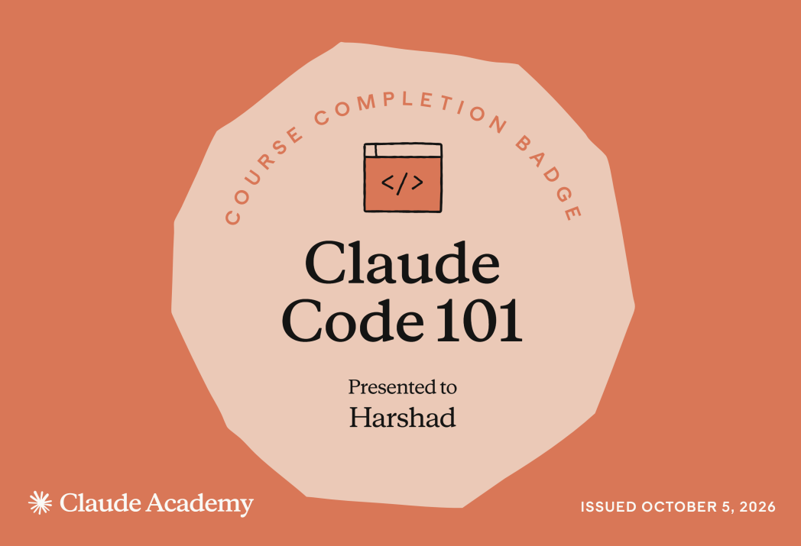
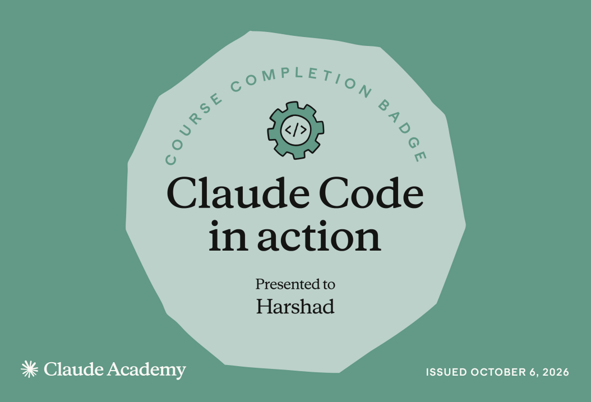
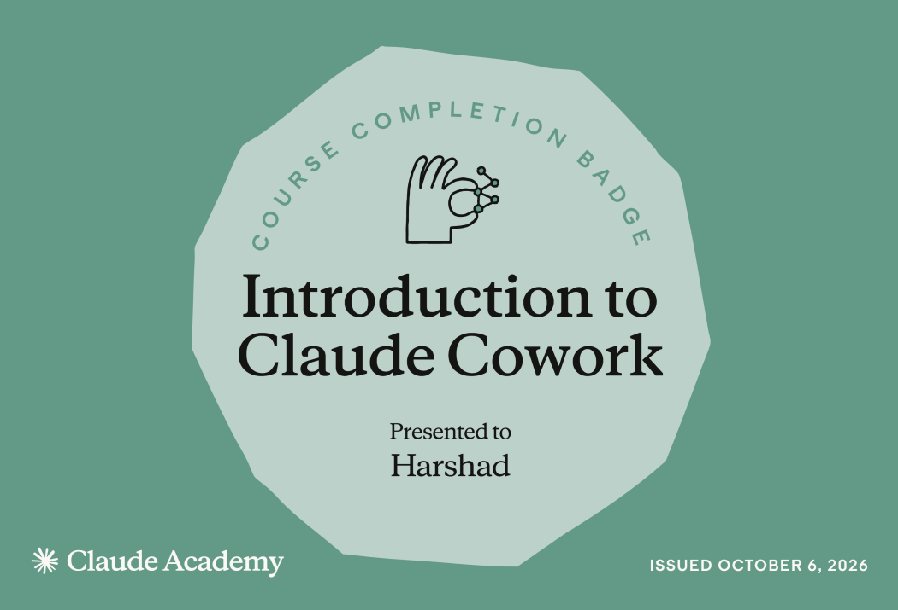

# Submission — Harshad

## Track
- [x] Track A — Claude Code (Pro)
- [ ] Track B — claude.ai web (free)

## Courses completed
- Claude Code 101 (Claude Academy) — 2026-10-05
- Claude Code in Action (Claude Academy) — 2026-10-06
- Introduction to Claude Cowork (Claude Academy) — 2026-10-06

## Proof
- **Completion badges:** [Claude Code 101](Claude101.png), [Claude Code in Action](ClaudeCode.png), [Introduction to Claude Cowork](ClaudeCowork.png)
- **LinkedIn post:** [Course completion post](https://lnkd.in/p/g-wj6_nd)

## My artifact
**Track A:** [NestJS/MongoDB Production Code Review skill](../../skills/nestjs-mongodb-production-code-review/)

The skill reviews Angular, NestJS, and MongoDB/Mongoose changes in Nx monorepos, tracing flows across the frontend, API, services, database, and queues. It checks contracts, authorization, tenant isolation, query performance, reliability, and test coverage, then reports evidence-based findings and a review verdict. It is review-only by default and asks before high-impact fixes.
