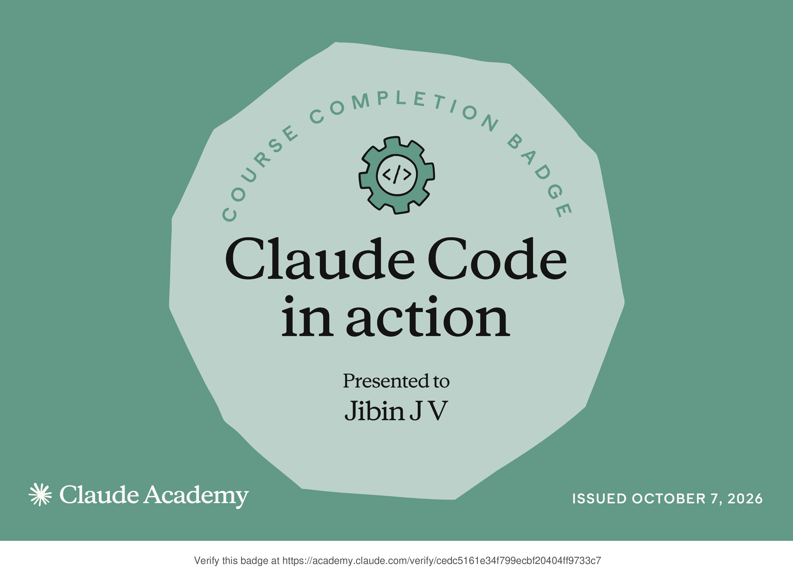

# Submission — Jibin JV

## Track

- [x] Track A — Claude Code (Pro)
- [ ] Track B — claude.ai web (free)

## Course(s) completed

- Claude Code in Action (Claude Academy) — 2026-10-07

## Proof

- **Completion badge:** [claude-code-in-action-badge.png](claude-code-in-action-badge.png) ([verify online](https://academy.claude.com/verify/cedc5161e34f799ecbf20404ff9733c7))
- **LinkedIn post:** https://lnkd.in/p/gUxCJpwe

## My artifact

**Track A**: Agent Skill, [`skills/jibin-jv-i18n-checker/`](../../skills/jibin-jv-i18n-checker/)

The skill checks i18n JSON translation files against `en.json`. It finds missing, extra and duplicate keys, key-order drift, blank lines and `{{placeholder}}` mismatches, then safely auto-fixes ordering and formatting and adds missing keys as `[TODO]` entries. The script has zero dependencies, works in CI, and comes with tests and demo fixtures. It generalises the i18n check we already run in our monorepo CI so any AMT project can use it.
