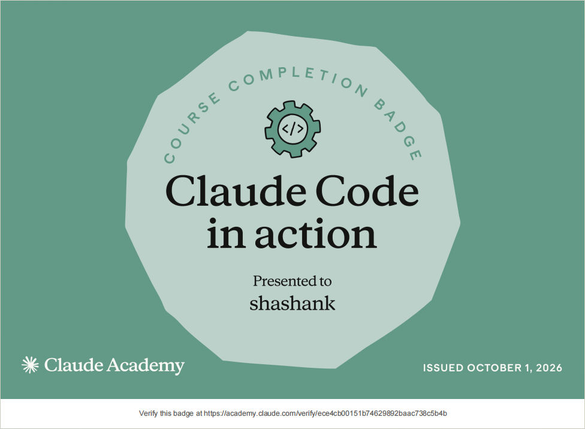

# Submission — Shashank

## Track

- [x] Track A — Claude Code (Pro)
- [ ] Track B — claude.ai web (free)

## Course(s) completed

- Claude Code in Action — October 1, 2026

## Proof

- **Completion badge:** [`claude-code-in-action-badge.png`](claude-code-in-action-badge.png) · [verify on Claude Academy](https://academy.claude.com/verify/ece4cb00151b74629892baac738c5b4b)
- **LinkedIn post:** https://lnkd.in/p/d_gmyST9



---

## What I built

Four Claude Code tools that take a ticket from **"what should we build?"** to **"PR opened"**, while making sure the code is secure and follows the decisions the team already made.

**Each tool works on its own.** Used together, they cover the whole life of a ticket.

> A **skill** is a command you type, like `/decide`.
> A **subagent** is a helper Claude hands a job to. You ask for it in plain words, like "use the security-reviewer on my changes".

## The four tools at a glance

| Tool | Type | In one line | When you use it | Works alone? |
|---|---|---|---|---|
| [`/decide`](../../skills/shashank-decide/) | Skill | Writes down the team's important technical decisions, with rules the code must follow | The team makes a big technical choice, or you start a ticket | ✅ Yes |
| [Decision Checker](../../subagents/shashank-decision-checker.md) | Subagent | Checks new code against those written decisions | Before you push, or any time | ✅ Yes (needs a `decisions/` folder in the project) |
| [Security Reviewer](../../subagents/shashank-security-reviewer.md) | Subagent | Finds real security holes in your changes, with proof and a fix | Before you push, or any time | ✅ Yes |
| [`/pre-push-gate`](../../skills/shashank-pre-push-gate/) | Skill | One command: runs the checks, then commits, pushes, and writes the PR description | Your branch is ready for a PR | Needs the Security Reviewer. Decision Checker is optional |

---

## Using them separately

### 1. `/decide` — remember why we built it this way

**The problem:** teams make big technical decisions, like "money is stored in paise" or "every database query filters by customer account". Months later the reason is lost in old chats, and someone breaks the decision without knowing it existed.

**What it does:** helps you make the decision and writes it down as a short file in a `decisions/` folder in your project. Each decision has **rules the code must follow**.

**How to use it:**

| You type | What happens |
|---|---|
| `/decide Should we use Redis or MongoDB for coupon counters?` | Looks at your code, compares 2–3 options (cost now, cost later, how hard to undo, risk, 10× traffic), recommends one, and saves it after you approve |
| `/decide` + paste meeting notes or a Slack thread | The same, starting from a discussion that already happened |
| `/decide brief NS-2541 coupons at checkout` | Tells you which decisions apply to your ticket **before** you write code |
| `/decide init` | For an existing project: finds the rules the code already follows and proposes them as decisions |
| `/decide accept 0012` / `/decide retire 0004` | Marks a decision as agreed by the team / no longer used |

**What you get:** a file like `decisions/0007-money-in-paise.md` with the decision, the reason, the options that were turned down, and the rules.

It **won't record small things**. Asked "for-of or forEach?", it says a code comment is enough. → [Full README](../../skills/shashank-decide/README.md)

### 2. Decision Checker — does the new code follow our decisions?

**What it does:** reads the project's `decisions/` folder and checks your **new or changed code** against the rules. Old code is never flagged.

**How to use it:** "Use the decision-checker on my changes against dev". Or say "run decision-checker audit" to check the whole project for code that has drifted from the decisions.

**What you get:**

```
🔴 coupon.service.ts:20 — 0002-R1 Every query filters by tenantId
   What: findOne({ code }) has no tenantId — one customer could use another's coupon
   Fix:  findOne({ code, tenantId })
⚠️ 0004 weakened in this branch — changed from "warn" to "off"
VERDICT: BLOCK
```

→ [How it works](#details-decision-checker)

### 3. Security Reviewer — is this change safe?

**What it does:** reviews your changes like a senior security engineer. It reports only real, exploitable problems, each with the exact line, why it's dangerous, an example attack, and the fix.

**How to use it:** "Use the security-reviewer on my changes against dev". It can also review only staged changes, a folder (`src/payment`), or the whole project.

**What you get:** findings grouped into 🔴 Blocking / 🟠 Should fix / 🔵 Info, ending with `VERDICT: BLOCK` or `PASS`. → [How it works](#details-security-reviewer)

### 4. `/pre-push-gate` — one command before every PR

**What it does:** runs the Security Reviewer, the Decision Checker (if the project has decisions), and a quick quality check (leftover `debugger`, `.only` tests, secret files, `console.log`, missing tests). Then:

- **review mode** only reports and doesn't touch git, or
- **auto mode** stops if something serious is found. Otherwise it writes the commit message, commits, pushes and writes the PR description, **asking you before each step**.

**How to use it:** `/pre-push-gate dev auto` or `/pre-push-gate dev review`. Here `dev` is the branch your PR will merge into. → [Full README](../../skills/shashank-pre-push-gate/README.md)

---

## Using them together

### One ticket, start to finish

Ticket **NS-2541: "Add discount coupons at checkout, each with a usage limit"**, in a project that has been running for a year:

```
 START                     DECIDE (only if needed)        BUILD           CHECK & PUSH
 /decide brief NS-2541 ──► /decide "how do we keep  ──►  write the  ──►  /pre-push-gate dev auto
 "money in paise,           the usage count correct?"     code             ├─ Security Reviewer ┐ at the
  filter by tenant…"        → saves decision 0012                          ├─ Decision Checker  ┘ same time
                                                                           ├─ quality check
                                                                           └─ commit → push → PR description
```

1. **Start:** `/decide brief` shows that three existing decisions apply: money in paise, filter by customer account, and services talk through the queue. You know the rules before writing a line.
2. **Decide:** the ticket needs a new choice: how to stop two users from using the last coupon at the same moment. `/decide` compares the options and saves **decision 0012**. The team approves it in the PR.
3. **Build:** you write the code.
4. **Check:** `/pre-push-gate` finds that the coupon lookup is missing the customer filter (this breaks a decision *and* is a security hole) and that money is stored as a float. **It blocks the push.**
5. **Fix and push:** you fix both, run it again, it passes, and it commits, pushes, and writes a PR description listing which decisions the change follows and that it adds 0012.
6. **Months later:** another developer gets a "gift cards" ticket. `/decide brief` already tells them about 0012. The knowledge was passed on without anyone having to remember it.

### Which tools to install

| You want | Install |
|---|---|
| Only a security check | Security Reviewer |
| Security check + safe commit, push and PR description | Security Reviewer + `/pre-push-gate` |
| Write down decisions and check code against them | `/decide` + Decision Checker |
| **The full workflow** | **All four** |

### Cheat sheet

| I want to… | Type in Claude Code |
|---|---|
| Write down the rules my project already follows | `/decide init` |
| Approve a decision | `/decide accept 0001` |
| Make a decision strict (stops the push) | `set decision 0001 to block` |
| Stop using an approved decision | `/decide retire 0001` |
| Record a new decision | `/decide Should we use Redis or MongoDB for coupon counters?` |
| See which decisions apply to my ticket | `/decide brief NS-2541 coupons at checkout` |
| Check my code against decisions | `Use the decision-checker on my changes against dev` |
| Check my code for security problems | `Use the security-reviewer on my changes against dev` |
| Check everything, report only | `/pre-push-gate dev review` |
| Check everything, then commit, push and write the PR description | `/pre-push-gate dev auto` |

**Tip:** you don't need exact commands. Plain words work too, for example "approve all decisions except 0006". Replace `dev` with the branch your PR will merge into. → [Full cheat sheet and approval steps](../../skills/shashank-decide/README.md#cheat-sheet)

---

## Why decisions?

On long-running projects, the costly mistakes are rarely typos. They're **broken decisions**: a query missing the customer filter, money stored as a float, two modules that were meant to stay separate calling each other directly. Code reviewers check whether code is *good*. Nothing checks whether it follows **what the team already decided**. That's the gap these tools fill.

How it stays trustworthy:

- **People decide, Claude advises.** Only decisions the team accepted are enforced.
- **Decisions are never rewritten.** To change one, you write a new decision that replaces it, so the reason for the change is kept.
- **Only new code is checked.** Changing a decision never breaks existing code.
- **Weakening a decision is always reported**, so no one can quietly loosen a rule to get past the check.

---

## Details: Security Reviewer

### How it works

1. **Scope.** It asks which branch your PR will merge into (`dev`, `main`, …) instead of guessing, then reviews everything that PR would bring in: committed work, uncommitted edits, and new files. Guessing wrong would pull in other people's work.
2. **Detects your tech stack** from files like `package.json`, `pom.xml` or `requirements.txt`, and adds checks for that language.
3. **Looks for 10 kinds of problems:** secrets left in code; untrusted input reaching a database query or shell command (injection); one user able to see or change another's data; weak login or session handling; private data leaking into logs or responses; unsafe settings; weak encryption or random numbers; the server fetching web addresses a user supplied; risky packages; and common mistakes in AI-written code.
4. **Checks before reporting.** For each problem it traces where the data comes from, whether it really reaches the risky line, and whether something already protects it. If it can't confirm, it lists the item under "Needs a human look" instead of calling it a bug. This keeps false alarms down.
5. **Reports** 🔴 / 🟠 / 🔵 with a `VERDICT` line that other tools (like `/pre-push-gate`) can read.

It's **read-only**: it can't edit files, run the app, or install anything, and it hides any secret it finds (shows only the first 4 characters).

### How it compares to SonarQube

It **adds to** SonarQube rather than replacing it. SonarQube runs fixed rules over the whole repo in CI. This reviewer reads your change the way a senior engineer would, and catches **logic and permission holes that fixed rules miss**, like "any logged-in user can delete any order".

### How I built it with Claude Code

- Researched the biggest day-to-day developer pain points (Stack Overflow 2025, Atlassian DevEx 2025). The security of AI-written code and slow reviews were near the top.
- Designed the scope rules and the "check before reporting" step so the findings can be trusted.
- Tested it on a throwaway project with 8 planted security holes (Node/Express and Python/Flask) and 2 pieces of safe code:

  | Planted issue | Result |
  |---|---|
  | SQL injection (query built from strings) | 🔴 caught |
  | Delete any user's order (missing ownership check) | 🔴 caught |
  | Reflected XSS | 🔴 caught |
  | Hard-coded live payment key | 🔴 caught (hidden in report) |
  | `pickle.loads` on request body (remote code run) | 🔴 caught |
  | Command injection via `shell=True` | 🔴 caught |
  | CORS `*` with credentials | 🟠 caught |
  | Package used but never declared (AI mistake) | 🔵 caught after one fix |
  | Safe query, scoped to the user | ✅ not flagged |
  | Fixed `subprocess` call, no user input | ✅ not flagged |

  The first run missed the undeclared package, so I added that check and ran it again: 8 of 8 caught, 0 false alarms.

### Limits

- It's an extra layer, not a certified scanner. Keep SonarQube/Snyk in CI.
- It reviews code. It doesn't attack a running app.
- Like any AI review it can miss something or over-flag, which is why every finding shows its reasoning.

---

## Details: Decision Checker

### How it works

1. **Reads the decisions.** It reads only the decisions the team **accepted** that apply to the files you changed. A change to `coupon.service.ts` might need 3 decisions out of 50.
2. **Looks only at new lines.** Existing code never blocks you, even when a decision changes.
3. **Finds, then confirms.** Each rule can include a search pattern to spot likely problems quickly. The checker then reads the code to confirm. If unsure, it lists the item under "Needs a human look".
4. **Respects agreed exceptions.** A comment like `// decision-exception: 0007-R2 reason: partner SDK returns a float` is accepted. One without a real reason (`reason: tbd`) is not.
5. **Also tells you:**
   - when a decision was **weakened** in this branch,
   - when a big new choice (a new database library, a new service) **has no decision** yet,
   - when a decision is **past its review date**,
   - when a rule has **5 or more exceptions**, which usually means the rule itself is wrong.
6. **Ends with `VERDICT: BLOCK`** if a decision marked "block" is broken, otherwise `PASS`.

It's **read-only**, like the Security Reviewer.

### How it was tested

On a demo NestJS + MongoDB project with 3 decisions and a coupon feature that broke them on purpose, it **caught 5 of 5** rule breaks (one was in a file not yet committed), flagged a decision switched off in the same branch, accepted the exception that had a real reason, rejected `reason: tbd`, and flagged nothing in correct code. → [Full results](../../skills/shashank-decide/README.md#how-i-tested-it)

### Limits

- It's only as good as the rules. That's why `/decide` refuses vague rules like "keep code clean".
- It reads code. It doesn't run it.

---

## What I learned

- A "check before you report" step matters more than a long checklist. It's what makes a team trust the output.
- Ending every check with a fixed `VERDICT:` line turns a chat answer into something other tools can build on. That's how four separate tools became one workflow.
- For decisions, the hard part isn't the checking. It's the life of a decision: who approves it, how it changes without losing history, and how to stop people quietly loosening it.
